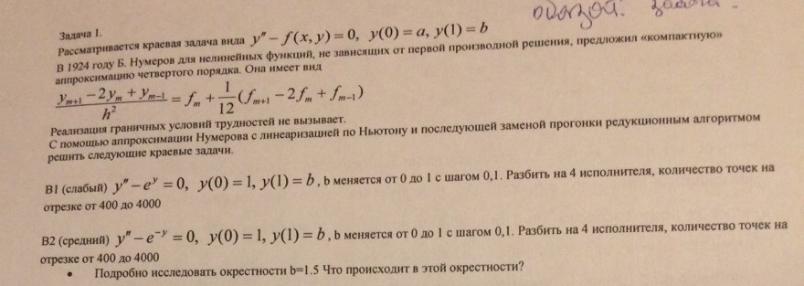

## Задачи осеннего семестра
В папке **scripts** лежат два скрипта, с помощью которых
удобно измерять зависимость времени подсчета от числа исполнителей.

### Вторая лабораторная
Выполнены варианты 2г, 2д из 
[этой методички](https://mipt.ru/drec/forstudents/study/studyMaterials/parallels/)
Оба варианта написаны с возможностью задавать размер вычислительной области
через параметры коммандной строки. 

* В варианте 2г распаралелливание по внешнему циклу.
* В варианте 2д с истинной зависимостью программа выбирает стратегию, 
основываясь на числе исполнителей. Расстояние зависимости равно 8 (по внешнему циклу), 
поэтому, когда p делит 8, делятся внешние циклы между исполнителями. Иначе — по внутреннему.
Барьер в этом случае не нужен, так как после каждого подсчета строки
исполнители обмениваются данными, нужными для подсчета следующей строки.

### Параллельный метод решения краевой задачи

Реализован вариант В2. В качесте нулевого приблежения
взята линейная функция, удовлетворяющая краевым условия:

y0(x) = (b-1)x + 1

Ее и надо прибавлять к посчитанному решению.
